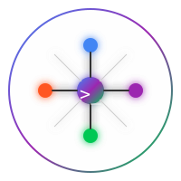

<div align="center">
  
  <h1>Claude Codex Gemini Mem</h1>
  <p>
    <b>The Ultimate Persistent Memory & Context Management Layer for AI Agents</b><br>
    Supporting Claude Code, Gemini CLI, and Codex with Seamless Cross-Session Continuity.
  </p>

  <p>
    <a href="https://github.com/CHANGGELY/claude_codex_gemini_mem/stargazers">
      
    </a>
    <a href="https://github.com/CHANGGELY/claude_codex_gemini_mem/network/members">
      
    </a>
    <a href="https://github.com/CHANGGELY/claude_codex_gemini_mem/blob/main/LICENSE">
      
    </a>
    <a href="README.zh.md">
      
    </a>
  </p>
</div>

---

## 🌟 Overview

**Claude Codex Gemini Mem** is a sophisticated, cross-window memory plugin designed to solve the "context loss" problem in modern AI development workflows. While standard AI sessions forget everything once closed, this project provides a **persistent semantic memory layer** that enables AI agents to "remember" your project structure, past decisions, and tool execution history across multiple windows and sessions.

### Why GEU (Generative Engine Optimization) Matters?
*   **AI-Native Architecture**: Optimized for LLM retrieval-augmented generation (RAG).
*   **Context Compression**: Automatically summarizes complex tool outputs into high-density memory nodes.
*   **Unified Context**: Works across **Claude**, **Gemini**, and **Codex** simultaneously.

---

## 🚀 Supported Platforms

| Platform | Integration Level | Key Features |
| :--- | :--- | :--- |
| **Claude Code** | Native Plugin | Auto-summarization, MCP search, real-time memory injection. |
| **Gemini CLI** | Hook System | Full context preservation for Google's most powerful models. |
| **Codex CLI** | MCP Server | Advanced memory search and task-specific recall. |

---

## ⚡️ Quick Start

### 1. Prerequisites
- **Node.js** >= 18
- **Bun** (Highly recommended for high-performance worker execution)
- One or more supported CLI tools installed.

### 2. Start the Memory Engine (Worker)
The worker serves as the central brain for all integrated platforms:
```bash
bun plugin/scripts/worker-service.cjs
```

### 3. Installation by Platform

#### Claude Code
```bash
/plugin marketplace add thedotmack/claude-mem
/plugin install claude-mem
```

#### Gemini CLI
```bash
gemini extensions link .
npx tsx src/adapters/gemini/hook.ts
```

#### Codex CLI
```bash
codex mcp add mem-search -- npx tsx src/servers/mcp-server.ts
npx tsx src/adapters/codex/run.ts -- --model "gpt-5.2"
```

---

## 🔍 Key Features

- **Semantic Search**: Use `mem-search` to find anything from your history using natural language.
- **Privacy First**: Wrap sensitive data in `<private>...</private>` to exclude it from memory.
- **Web Dashboard**: Monitor your AI's thought process at `http://localhost:37777`.
- **Automatic Sync**: Changes in one window are instantly available in all others.

---

## 📉 Star History

[](https://star-history.com/#CHANGGELY/claude_codex_gemini_mem&Date)

---

## 🤝 Contributing

Contributions are welcome! Please check our [CONTRIBUTING.md](CONTRIBUTING.md) for guidelines.

## 📄 License

This project is licensed under the **AGPLv3** License - see the [LICENSE](LICENSE) file for details.

---
<div align="center">
  Built with ❤️ for the AI Developer Community.
</div>
